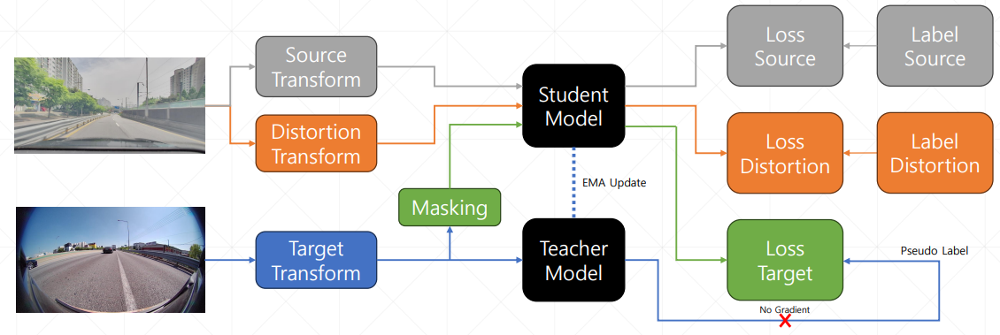
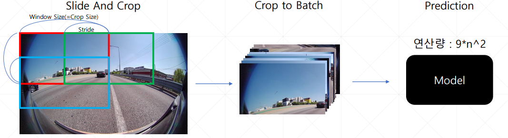
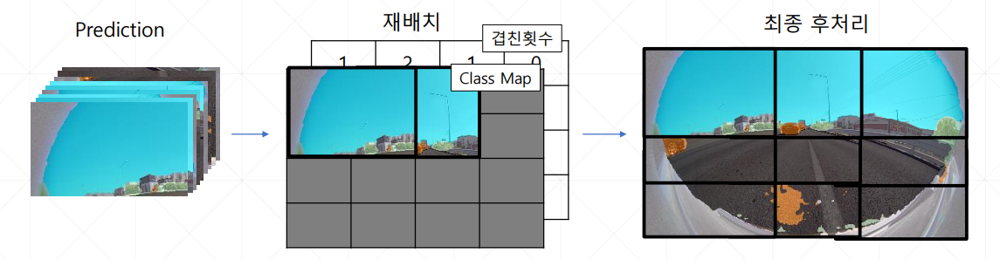

# Unsupervised-Domain-Adaptation-with-Distortion-Aware
2023 Samsung AI Challenge : Camera-Invariant Domain Adaptation (2023-08-21 ~ 2023-10-02) [Private 9th Solution]

대회 사이트 주소 : [DACON, 2023 Samsung AI Challenge : Camera-Invariant Domain Adaptation](https://dacon.io/competitions/official/236132/overview/description)

---

## UDA 구조

<p align="center"></p>

---

## 추론 방식

<p align="center"></p>

<p align="center"></p>

### MiT-B3 기준 FPS

GPU : Tesla T4 

|Image Size|Crop Size|Stride|FPS|
|---|---|---|---|
|(256, 512)|X|X|27FPS|
|(512, 1024)|X|X|10FPS|
|(512, 1024)|(256, 512)|(128, 256)|25FPS|

---

## 성능

### Crop크기에 따른 성능차이

|Image Size|Crop Size|Public Score|
|---|---|---|
|(256, 512)|X|0.5655|
|(256, 512)|(128, 256)|0.5517|
|(512, 1024)|(256, 512)|0.6258|

### Encoder에 따른 성능과 FPS

|Encoder|FPS|Public Score|Weight|
|---|---|---|---|
|MiT-B3|25|0.6231|[weights](https://drive.google.com/file/d/1vzQOudyrv-0gtI1pWJ-WoQaRZWC6agWv/view?usp=drive_link)|
|MiT-B4|15|0.6258|[weights](https://drive.google.com/file/d/1yBU_3mqMkzyvOcs_skZOQlQXvSg5kBEs/view?usp=drive_link)|
|MiT-B5|10|0.6099|[weights](https://drive.google.com/file/d/1lIR4q2hWVcLGyAHskTxa6j9VqK27S1PN/view?usp=drive_link)|


---

## Directory 구조

```
/content/drive/MyDrive/samsung_seg(512,1024)
├── model
├── test_image
├── train_source_gt
├── train_source_image
├── train_target_image
├── val_source_gt
└── val_source_image
```

